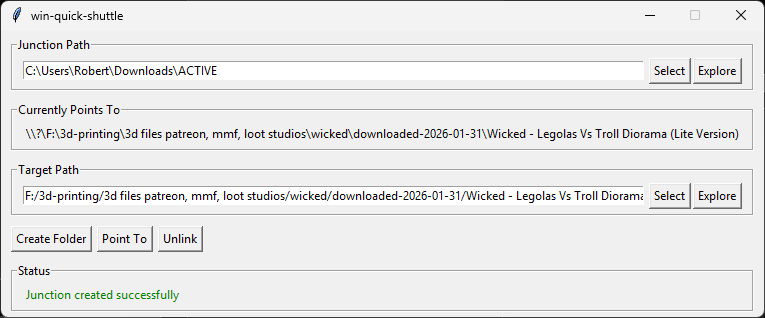

# win-quick-shuttle

A tiny Windows utility for rapidly redirecting directory junctions — like a shuttle or chute that instantly reroutes files from one place to another.



## What It Does

**win-quick-shuttle** manages Windows NTFS directory junctions, letting you quickly change where a folder "points to" without moving any files.

**The idea:** You have a fixed location that programs write to (like `C:\Users\You\Downloads\ACTIVE`), but you want those files to actually land in different project folders depending on what you're working on. Instead of changing settings in every program, you just redirect the junction.

```
C:\Users\You\Downloads\ACTIVE  →  C:\Projects\ProjectA\assets
                                   (click)
C:\Users\You\Downloads\ACTIVE  →  C:\Projects\ProjectB\downloads
                                   (click)
C:\Users\You\Downloads\ACTIVE  →  F:\3d-printing\current-project
```

Programs like Chrome keep downloading to `ACTIVE`, but the files magically appear wherever you've pointed the junction.

## Installation

Requires Python 3.10+ and Windows.

```bash
pip install win-quick-shuttle
```

Or install from source:

```bash
git clone https://github.com/LionKimbro/win-quick-shuttle.git
cd win-quick-shuttle
pip install -e .
```

## Quick Start

### Set your default junction path (one time)

```bash
win-quick-shuttle set junction "C:\Users\You\Downloads\ACTIVE"
```

### Launch the GUI

```bash
win-quick-shuttle run
```

### Use the GUI

1. **Junction Path** — The fixed location programs write to
2. **Currently Points To** — Where files actually go right now
3. **Target Path** — Where you want files to go
4. **Create Folder** — Make the target folder if it doesn't exist
5. **Point To** — Redirect the junction to the target
6. **Unlink** — Remove the junction entirely

**Select** buttons open a folder picker. **Explore** buttons open Windows Explorer at that location.

## CLI Commands

```bash
# Set defaults (persisted between sessions)
win-quick-shuttle set junction "C:\Users\You\Downloads\ACTIVE"
win-quick-shuttle set target "C:\Projects\Default"

# Check current settings
win-quick-shuttle get junction

# Launch GUI with saved settings
win-quick-shuttle run

# Override for one session
win-quick-shuttle run --junction "C:\Other\Path"

# Help
win-quick-shuttle help
```

## Original Use Case: Chrome Downloads

Chrome doesn't let you easily switch download folders on the fly. But you can:

1. Set Chrome's download location to a junction folder (e.g., `Downloads\ACTIVE`)
2. Use win-quick-shuttle to point that junction wherever you need
3. Download files — they land in your target folder
4. Redirect to a different folder for the next batch

No more digging through a cluttered Downloads folder or manually moving files.

## How Junctions Work

A Windows directory junction is like a portal — programs see it as a regular folder, but everything written to it actually goes somewhere else. Unlike shortcuts, junctions are transparent to applications.

win-quick-shuttle creates and manages these junctions using the Windows `mklink /J` command.

## Dependencies

- **[lionscliapp](https://github.com/LionKimbro/lionscliapp)** — Humane CLI framework with persistent configuration

## License

CC0 1.0 Universal — Public Domain. Do whatever you want with it.
